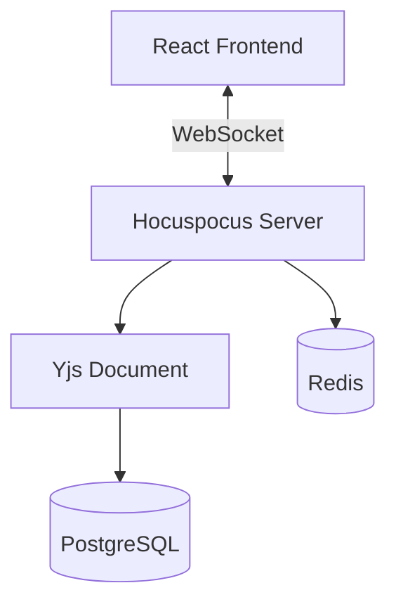

# Nexus: Distributed State Synchronization Engine

Nexus is a distributed state synchronization engine that powers a real-time collaborative infinite whiteboard. It allows multiple users to draw, create, and edit shapes on a shared infinite canvas simultaneously. The project is under active development, with a focus on distributed state management to keep clients in sync without data conflicts, even under network latency.

## Project Status

**Current Phase:** MVP Development

Completed milestones:
- [x] Project setup
- [x] Architecture design
- [x] ADR documentation
- [x] Authentication (registration, login, JWT access/refresh tokens, HTTP-only cookies, logout, protected routes)
- [x] Authentication UI
- [x] Workspace UI

Current work:
- [ ] Canvas


## Why Nexus?

Nexus exists to explore the engineering challenges behind real-time collaborative software — the same class of problems solved by tools like Figma and Miro. Distributed collaborative systems are interesting because they force explicit decisions about consistency, conflict resolution, and state ownership under concurrent access.

This project is a hands-on exploration of:
- CRDT-based conflict resolution (Yjs)
- WebSocket-based real-time synchronization
- Separation of collaborative state from persistent business data
- Incremental, MVP-first system design

## Engineering Goal

Nexus is built to explore the challenges of real-time collaborative software. The MVP focuses on three core problems:

- **Real-time collaboration:** Multiple users drawing and editing on the same whiteboard simultaneously.
- **Conflict resolution:** Concurrent edits stay consistent across all connected clients using CRDTs.
- **Responsive experience:** The infinite canvas remains interactive while synchronizing changes in real time.

Later phases will address scaling, presence systems, background processing, and distributed infrastructure.

## MVP Philosophy

The goal of Nexus is not to replicate every feature of Figma or Miro. The project follows an iterative approach:

1. Build a minimal collaborative whiteboard.
2. Ship a working MVP.
3. Improve collaboration features.
4. Optimize for scale.
5. Add enterprise-level capabilities.

Every phase should produce a deployable product.

## Architecture Overview



Yjs holds the live collaborative state as the single source of truth. PostgreSQL persists periodic snapshots and business data (users, workspaces, memberships), while Redis handles ephemeral presence data and cross-instance messaging.

## Tech Stack

### Current Stack

**Frontend**
- Vite
- React + TypeScript
- tldraw (infinite canvas rendering, drawing, shapes, zoom/pan/drag)
- Tailwind CSS

**Sync Layer**
- Yjs (CRDT engine)
- Hocuspocus (WebSocket server for Yjs)

**Backend**
- Node.js
- Express
- TypeScript
- PostgreSQL
- Prisma (ORM)
- Redis
- Docker (local environment orchestration)
- Zod (runtime schema validation)
- Argon2 (password hashing)
- JSON Web Token (JWT)
- Cookie Parser

### Planned Infrastructure

- BullMQ (background job processing)
- Monitoring and observability tooling
- Metrics collection
- PNG/PDF export services
- Horizontal WebSocket scaling
- Framer Motion (UI transitions)
- React Virtuoso (list virtualization)

## Folder Structure
```nexus/
    ├── frontend/
    ├── backend/
    ├── docs/
    │ └── architecture/
    └── docker-compose.yml
```


## Architecture Decisions

Architectural decisions are documented as Architecture Decision Records (ADRs) under `docs/architecture/`. Each ADR captures the context, alternatives considered, and rationale behind a decision, so future contributors (including future me) understand why the system is structured the way it is rather than re-litigating settled choices.

## Engineering Principles

These principles guide development decisions across the project:

- Ship before optimizing.
- One source of truth for every piece of data.
- Feature-first architecture over technical-layer organization.
- Avoid premature abstraction.
- Introduce infrastructure only when it solves a real problem.
- Build production-quality code from day one, but only for the current scope.
- Prefer simple solutions unless complexity is justified by measurable benefits.

## Development Environment

Nexus uses a two-folder structure to separate frontend and backend concerns without the overhead of a monorepo.

- **Structure:** Standard `frontend` (Vite) and `backend` (Node.js/Express) directories.
- **Orchestration:** Docker runs local instances of PostgreSQL and Redis to keep dev and production environments consistent.
- **Validation:** Zod enforces schema validation across frontend, backend, and WebSocket payloads.

## Authentication

Authentication is fully implemented and tested on the backend.

Implemented features:
- User registration
- User login
- Argon2 password hashing
- Access tokens
- Refresh tokens
- Refresh token persistence (hashed)
- HTTP-only cookies
- Logout
- Protected routes (auth middleware)

**Flow:**

```
Register/Login
    ↓
Argon2 verifies credentials
    ↓
Access Token (short-lived) + Refresh Token (persisted, hashed)
    ↓
HTTP-only Cookies set
    ↓
Protected Route Middleware validates Access Token
    ↓
Refresh Endpoint issues new Access Token when expired
    ↓
Logout revokes Refresh Token
```

## Current Backend Architecture

```
Request
    ↓
Route
    ↓
Validation Middleware
    ↓
Controller
    ↓
Service
    ↓
Repository
    ↓
Prisma
    ↓
PostgreSQL
```

## Implementation Roadmap

### Phase 1 — Collaborative Whiteboard (MVP)

Goal: Build the smallest deployable collaborative whiteboard.

- [x] Initialize frontend (Vite + React + TypeScript)
- [x] Initialize backend (Node.js + Express + TypeScript)
- [x] Configure PostgreSQL using Docker
- [x] Configure Prisma
- [x] Authentication (registration, login, password hashing)
- [x] JWT (access token generation)
- [x] Refresh Tokens (persistence, refresh endpoint)
- [x] Protected Routes (auth middleware)
- [x] Authentication UI (Pending)
- [x] Workspace CRUD (Pending)
- [x] Create shared Zod schemas
- [x] Integrate tldraw
- [x] Local shape creation (drawing, sticky notes, text, basic shapes)
- [x] Local shape editing
- [x] Local shape dragging and positioning on the infinite canvas
- [ ] Integrate Hocuspocus
- [ ] Integrate Yjs
- [ ] Synchronize whiteboard between multiple users
- [ ] Save and load workspaces from PostgreSQL
- [ ] Deploy MVP

### Phase 2 — Collaboration Experience

Goal: Make collaboration feel polished.

- [ ] User presence
- [ ] Ghost cursors
- [ ] Online status
- [ ] Reconnection handling
- [ ] Undo / Redo improvements
- [ ] Workspace routing
- [ ] Better loading states

### Phase 3 — Scaling

Goal: Support larger workloads.

- [ ] Redis Pub/Sub
- [ ] Horizontal WebSocket scaling
- [ ] Snapshot optimization
- [ ] API rate limiting
- [ ] Logging
- [ ] Monitoring
- [ ] Metrics

### Phase 4 — Advanced Features

Goal: Introduce enterprise-level functionality.

- [ ] PNG export
- [ ] PDF export
- [ ] BullMQ background workers
- [ ] Organization support
- [ ] Roles & Permissions
- [ ] Audit logs
- [ ] Analytics

## MVP Scope

The first release includes only the features required to demonstrate a working collaborative whiteboard engine.

**Included**
- User authentication (implemented)
- Workspace creation (next feature)
- Shared infinite canvas
- Drawing and shape creation
- Real-time synchronization
- Persistent storage
- Multi-user editing
- Deployment

**Not included**
- Presence
- Comments
- Chat
- Version history
- Export
- Teams
- Notifications
- Analytics
- AI features

These features will be introduced incrementally after the MVP is deployed.

## Future Improvements

After the MVP is stable, planned work includes:

- Redis-backed presence system
- Horizontal scaling
- Background workers
- Snapshot optimization
- Operational Transform benchmarking
- Monitoring & observability
- Advanced permissions
- Team workspaces
- Export services